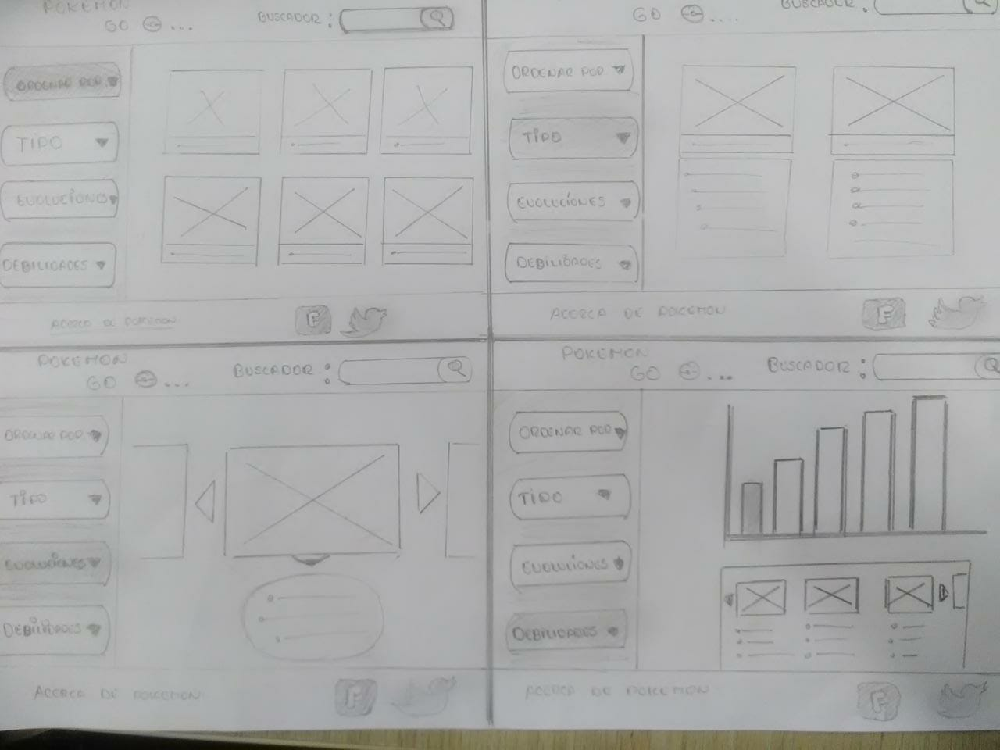
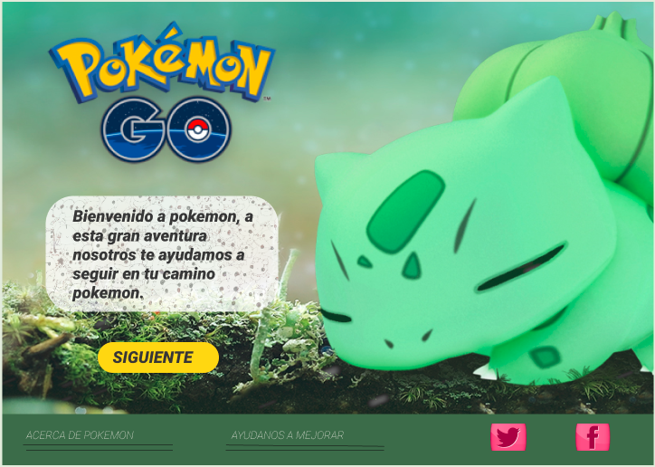
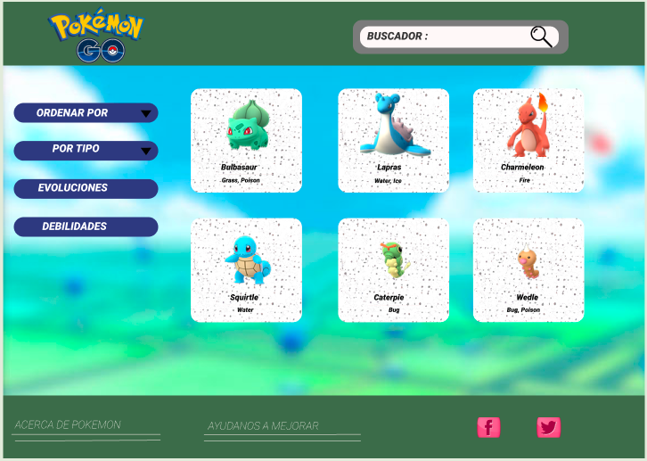
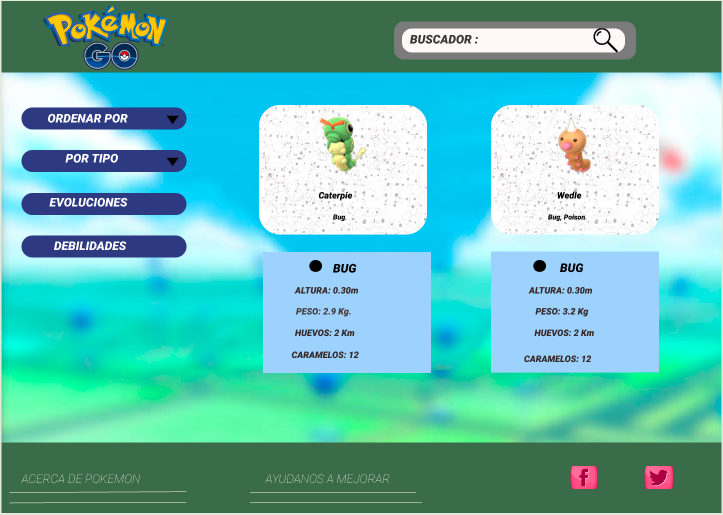
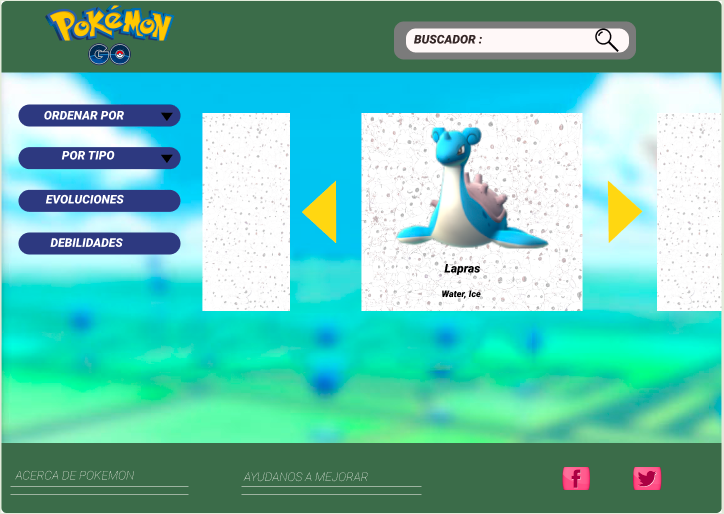
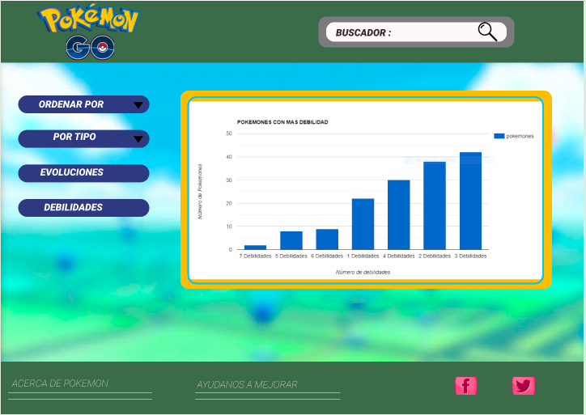

# POKEMON GO 

## Índice

* [Preámbulo](#producto)
* [Historias de Usuario](#historias-de-usuario)
* [Sketch de solución (Prototipo de baja fidelidad)](sketch-de-solución)
* [Diseño de Interfaz de Usuario](#diseño-de-interfaz-de-usuario)
* [Link a Zeplin](#link-a-zeplin)
* [Test de Usabilidad](#test-de-usabilidad)

***

## Producto

Interfaz que permite la visualizacion y manipulacion de la data de  Pokemon, segun las necesidades descubiertas en las entrevistas de usuario.

### Proceso de Diseño

Se realizo entrevistas para conocer los intereses, motivaciones y aspiraciones de los jugadores de Pokemon GO.  Se indago y obtuvo informacion de los problemas, requerimientos, que les gustaria ver de los datos de pokemon para mejorar su nexperiencia de usuario, con ello se elaboro 7 historias de usuario:

* Saber que pokemon es especial (pokemon shiny) para capturarlos.
* Conocer los niveles IV y salud de los pokemon para tener mayor probabilidad de ganar las batallas.
* Calcular el nivel de fortalezas y debilidades, y mostrar.
  los pokemones agrupados según nivel de fortaleza o debilidad.
* Conocer que cantidad de caramelos necesita su pokemon para evolucionar.
* Saber cuantos kilometros caminar para encontrar los huevos.
* Saber la cuantos pokemones puedo almacenar.
* Filtrar por tipo para encontrar con mas facilidad los pokemones segun preferencia.
* Necesita un buscador por nombre para ver todos los datos de un pokemon especifico
* Ordenar los pokemones alfabeticamente para poder visualizar todos los pokemones 
  de manera ordenada y asi encontrar el pokemon de su interés.

Luego se prorizo las que eran factibles de realizar, segun la data proporcionada para el proyecto.

## Historias de Usuario

Se priorizó las siguientes historias:

* Ordenar los pokemones alfabeticamente para poder visualizar todos los pokemones
  de manera ordenada y asi encontrar el pokemon de su interés.
* Filtrar por tipo para encontrar con mas facilidad los pokemones segun preferencia.
* Conocer que cantidad de caramelos necesita su pokemon para evolucionar.
* Calcular el nivel de fortalezas y debilidades, y mostrar.
  los pokemones agrupados según nivel de fortaleza o debilidad.

## Sketch de solución
(Prototipo de baja fidelidad)

Se utilizo papel y lápiz para idear una solucion que muestre una interfaz amigable.

## Diseño de Interfaz de Usuario
(Prototipo de alta fidelidad)

Se utilizó Figma para diseñar la interfaz e iterar segun los test de usabilidad
[link a Figma](https://www.figma.com/file/OFdpWerGnAmOZmPcyGSwPTaG/POKEMON-GO?node-id=15%3A3)

## Link a Zeplin

[link a Zeplin](https://app.zeplin.io/project/5c362828eddc504bd2288b89/dashboard)

## Test de Usabilidad

A través del test de usabilidad se detectó problemas, se iteró segun sugerencias de usarios.

### Lista de problemas detectados y resueltos:

* Falta una introduccion que indique lo que realiza la app web.
* Colores que no guardan relacion de una vista a otra.
* Segerencia de poner bordes redondeados a los cards.
